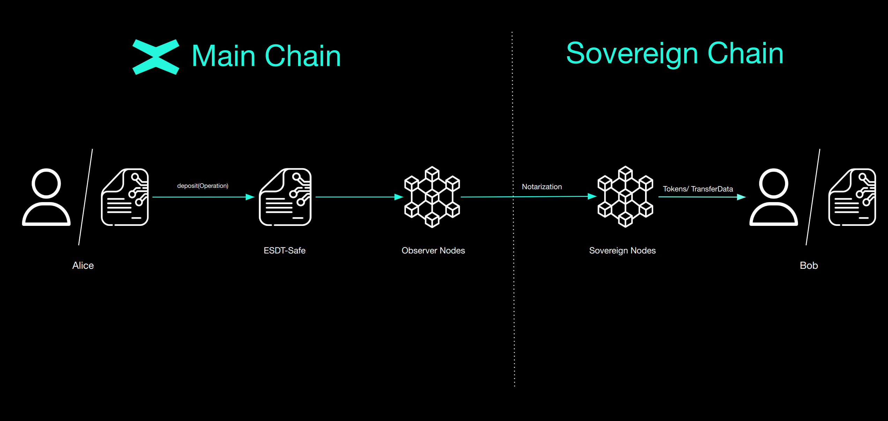

# Execution going to a Sovereign Chain


The ability to bridge tokens from the Mainchain to any Sovereign Chain is a required feature since any Sovereign will have the ability to be connected to the Main MultiversX Chain. With that the customizable Sovereign will have the ability to use any token used in the default network.

The most innovative part of the bridging mechanism from the Mainchain is that it is completely off-chain. The transfer of tokens is done by the *ESDT-Safe* contract after calling the `deposit` endpoint inside the `to-sovereign` module. 

#### Sovereign Chain depositing flow
1. User deposits the tokens he wishes to bridge in the ESDT-Safe contract.
2. Validators in the Sovereign Chain monitor the mainchain headers and push the header, the bridge transactions and the corresponding proofs to the Sovereign Chain.
3. Leaders include proofs of execution from the mainchain. The notifier/proof system provides an abstracted interface through which Sovereign nodes can verify and validate the authenticity of data.
4. After verifying the proofs, the Incoming Transactions Processor processes the incoming transactions, and the user receives the tokens on the Sovereign Chain.

:::note
Here is the [link](https://github.com/multiversx/mx-sovereign-sc/blob/main/esdt-safe/src/to_sovereign/create_tx.rs) to the `deposit` endpoint.
:::

### Depositing
```rust
    #[payable("*")]
    #[endpoint]
    fn deposit(
        &self,
        to: ManagedAddress,
        optional_transfer_data: OptionalValueTransferDataTuple<Self::Api>,
    )
```

Depositing tokens to the Sovereign Chain is an important feature. One key aspect is being able to bridge tokens and also execute any endpoints within a single transaction. This endpoint first checks if the current Sovereign Chain has any enabled fees. Keep in mind that a maximum of 10 transfers per transaction is allowed.

Since a token whitelist system is in place, each token received by this endpoint has to be whitelisted; if not, it will be refunded. In a successful scenario the tokens will be verified for the corresponding chain prefix and will be burned.

As suggested by the parameters, the TransferData value can be optional. If any value is provided, there are 2 checks needed to be done before finishing bridging process:

- Check if the gas limit is under the specified limit.
- If the endpoint that has to be executed is not banned.

As mentioned in the diagram, the bridging process to the Sovereign Chain is being done with events. At the end of the deposit() endpoint, an event will be emitted and then the bridging process is complete.


```rust
#[event("deposit")]
fn deposit_event(
    &self,
    #[indexed] dest_address: &ManagedAddress,
    #[indexed] tokens: &MultiValueEncoded<MultiValue3<TokenIdentifier, u64, EsdtTokenData>>,
    event_data: OperationData<Self::Api>,
)
```

The event will propagate to the network information about the destination address and what tokens have been bridged in order to be handle by the protocol.
